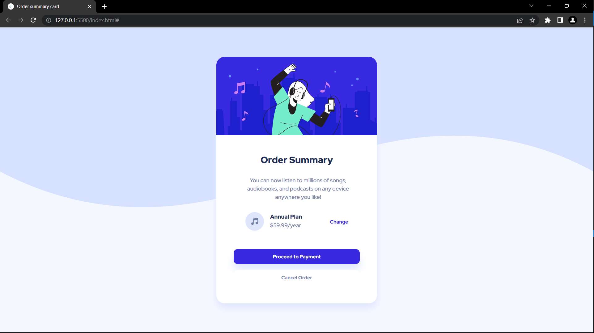

# Frontend Mentor - Order summary card solution

This is a solution to the [Order summary card challenge on Frontend Mentor](https://www.frontendmentor.io/challenges/order-summary-component-QlPmajDUj). 

## Table of contents

- [Overview](#overview)
  - [Screenshot](#screenshot)
  - [Links](#links)
- [My process](#my-process)
  - [Built with](#built-with)
  - [What I learned](#what-i-learned)
  - [Useful resources](#useful-resources)
- [Author](#author)

## Overview

### The challenge

Users should be able to:

- See hover states for interactive elements

### Screenshot

### Links

- Solution URL: [Add solution URL here](https://your-solution-url.com)
- Live Site URL: [Add live site URL here](https://your-live-site-url.com)

## My process

### Built with

- Semantic HTML5 markup
- CSS custom properties
- Flexbox
- Used media query

### What I learned

Learn background properties. Understand the Opacity & box shadow properties.

### Useful resources

- [box-shadow](https://css-tricks.com/almanac/properties/b/box-shadow/) - This helped me for box shadow properties. I really liked this pattern and will use it going forward.
- [opacity](https://css-tricks.com/almanac/properties/o/opacity/) - This is an amazing article which helped me finally understand opacity. I'd recommend it to anyone still learning this concept.

## Author

- Website - [Shubham](https://github.com/TJ-Shubham)

